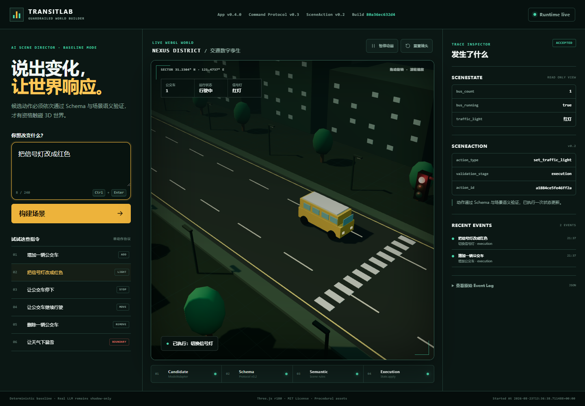

# TransitLab — Guardrailed AI World Builder

TransitLab turns plain-language traffic instructions into validated scene actions and a live browser-native 3D world.

```text
User prompt
→ ModelAdapter candidate
→ SceneAction Protocol v0.2
→ Schema validation
→ Semantic validation
→ SceneState.apply
→ Three.js renderer
→ Explainable Event Log
```

The differentiator is not merely prompt-to-3D. The interface makes the safety boundary visible: invalid, ambiguous, or impossible actions are rejected before they can mutate the scene.

## Current prototype

Version `0.4.0` is a hackathon-preparation prototype:

- real WebGL 3D district rendered with Three.js;
- procedural buses, roads, signals, streetlights, trees, and buildings;
- mouse/touch camera orbit, wheel zoom, reset, and visual pause;
- six scene actions through a versioned protocol;
- visible Candidate → Schema → Semantic → Execution trace;
- read-only scene inspector and raw Event Log;
- deterministic browser path plus a real-LLM shadow evaluation path;
- runtime fingerprint and `/health` identity check;
- Python standard-library server and test suite.



The browser execution path still uses `FakeModelAdapter`. The real LLM remains shadow-only and cannot call `SceneState.apply`. This is intentional until evaluation evidence supports promotion.

## Run locally

The reproducible runtime is pinned to Python `3.13.5`; the application itself uses only the Python standard library.

```powershell
cd "D:\ai-builder-traffic-lab"
python -m unittest discover -s ai_builder/tests -v
python -m ai_builder.server
```

Open:

- Demo: [http://127.0.0.1:8000](http://127.0.0.1:8000)
- Runtime identity: [http://127.0.0.1:8000/health](http://127.0.0.1:8000/health)
- Render state: [http://127.0.0.1:8000/api/state](http://127.0.0.1:8000/api/state)

The WebGL renderer loads the pinned Three.js module from jsDelivr, so the first browser load requires internet access.

## Public deployment preparation

The repository includes a reproducible Render Blueprint in [`render.yaml`](render.yaml). It defines one free Python web service, runs the complete test suite during the build, starts the standard-library HTTP server, and checks `GET /health`. Automatic deployment is deliberately disabled so a documentation-only commit cannot silently replace the judged demo.

The server keeps loopback defaults locally and automatically binds to `0.0.0.0:$PORT` when Render supplies `PORT`. No database, Redis instance, Docker image, or API key is required for the deterministic public demo.

Deployment is prepared but not yet live. After the v0.4 commit is available on GitHub, open the [Render Blueprint](https://dashboard.render.com/blueprint/new?repo=https://github.com/Cluckin-VV/AI-builderkack-traffic-lab), review the single service, and apply it. The complete verification and rollback procedure is in [`docs/public-deployment-v0.4.md`](docs/public-deployment-v0.4.md).

## Supported instructions

Try:

- `增加一辆公交车`
- `删除一辆公交车`
- `把信号灯改成红色`
- `把红灯变回绿色`
- `让公交车停下`
- `让公交车继续行驶`

Unsupported or combined requests are rejected without changing state, for example:

- `让天气下暴雪`
- `增加公交车并把灯变红`
- `让公交车在红灯前停下`

## Architecture boundary

`scene3d.js` is a renderer. It receives scene data and controls only camera and visual animation. It does not parse commands, create `SceneAction`, run validation, or write server state.

The only browser mutation route is:

```text
POST /command
→ injected ModelAdapter
→ JSON
→ schema validator
→ semantic validator
→ SceneState.apply (accepted only)
```

## Hackathon status

This repository is preparing for the AI Builder Hackathon 2026. Kaggle participation is confirmed and the submission writeup is saved as a draft. It is not yet a final submission: the hosted demo, sub-three-minute video, and final public-repository synchronization are still outstanding.

See [docs/hackathon-prototype-v0.4.md](docs/hackathon-prototype-v0.4.md) for the rules-fit audit and [THIRD_PARTY_NOTICES.md](THIRD_PARTY_NOTICES.md) for dependency provenance.

## Known limits

- deterministic commands do not yet generalize to arbitrary natural language;
- the real LLM path is evaluation-only;
- state and Event Log are process-local and reset when the server restarts;
- vehicles follow visual loops rather than traffic physics or path planning;
- the demo depends on a CDN-hosted Three.js module;
- the Render deployment is configured but no hosted public URL has been created yet;
- all visitors to one server instance share process-local demo state.

## License and provenance

All scene geometry is generated in project code; no external 3D assets are used. Three.js is used under the MIT License. See [THIRD_PARTY_NOTICES.md](THIRD_PARTY_NOTICES.md).
