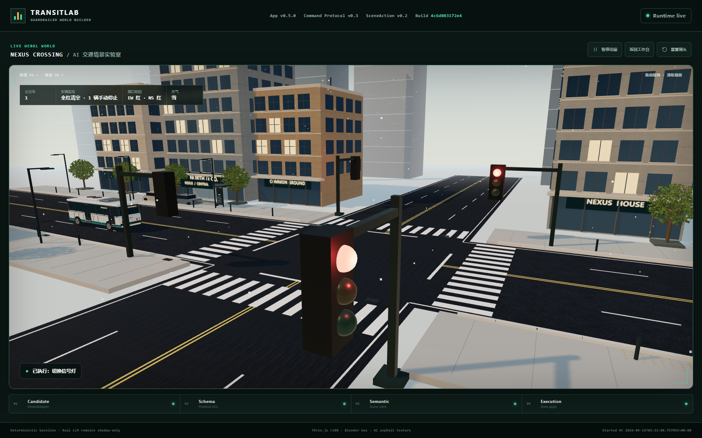
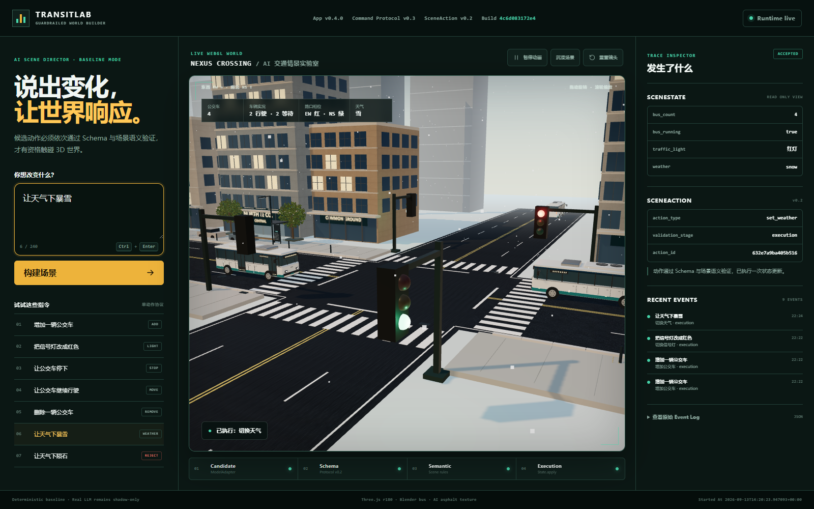

# TransitLab — Guardrailed AI World Builder

TransitLab turns plain-language traffic instructions into validated scene actions and a live browser-native 3D world.

```text
User prompt
→ ModelAdapter candidate
→ SceneAction Protocol v0.2
→ Schema validation
→ Semantic validation
→ SceneState.apply
→ Three.js renderer
→ Explainable Event Log
```

The differentiator is not merely prompt-to-3D. The interface makes the safety boundary visible: invalid, ambiguous, or impossible actions are rejected before they can mutate the scene.

## Current release candidate

Version `0.5.0` is the competition release candidate:

- real WebGL crossroads district rendered with Three.js;
- Blender-authored electric buses, detailed streets, storefronts, signals and instanced foliage;
- four straight traffic approaches with mutually exclusive EW/NS right-of-way, stop lines and an all-red clearance phase;
- clear, rain, snow and fog scene modes with visible weather and simplified speed policies;
- mouse/touch camera orbit, wheel zoom, reset, and visual pause;
- six scene actions through a versioned protocol;
- visible Candidate → Schema → Semantic → Execution trace;
- read-only scene inspector and raw Event Log;
- deterministic browser path plus a real-LLM shadow evaluation path;
- runtime fingerprint and `/health` identity check;
- Python standard-library server and test suite.


[Watch/download the 2:12 English-captioned demo](https://github.com/Cluckin-VV/AI-builderkack-traffic-lab/releases/download/v0.5.0-rc.1/transitlab-v05-demo-final.mp4) · [Release and verification details](https://github.com/Cluckin-VV/AI-builderkack-traffic-lab/releases/tag/v0.5.0-rc.1)

### Crossroads and city art

The v0.5 candidate adds an original editable Blender bus, AI-generated asphalt and limestone textures, material-batched architecture, leaf-level foliage, real-time planar wet-road reflections and a deterministic crossroads controller. The **沉浸场景** button expands the viewport without changing scene state. This is an interactive WebGL scene, not an image used as the background.



The public Render deployment was verified on 2026-09-14 at App `0.5.0`, commit `038a9ef`, fingerprint `4c6d083172e4`. Public HTTP, WebGL interaction and mobile-layout checks passed; [deployment evidence and cold-start caveats](docs/public-deployment-v0.5.md) are recorded separately. See [asset provenance, reproduction and verification](docs/visual-city-upgrade-v0.1.md). This is a more detailed real-time art direction, not a claim of photorealism or traffic-simulation accuracy.

The browser execution path still uses `FakeModelAdapter`. The real LLM remains shadow-only and cannot call `SceneState.apply`. This is intentional until evaluation evidence supports promotion.

## Run locally

The reproducible runtime is pinned to Python `3.13.5`; the application itself uses only the Python standard library.

```powershell
cd "D:\ai-builder-traffic-lab"
python -m unittest discover -s ai_builder/tests -v
python -m ai_builder.server
```

Open:

- Public demo: [https://ai-builderkack-traffic-lab.onrender.com](https://ai-builderkack-traffic-lab.onrender.com)
- Demo: [http://127.0.0.1:8000](http://127.0.0.1:8000)
- Runtime identity: [http://127.0.0.1:8000/health](http://127.0.0.1:8000/health)
- Render state: [http://127.0.0.1:8000/api/state](http://127.0.0.1:8000/api/state)

The WebGL renderer loads the pinned Three.js module from jsDelivr, so the first browser load requires internet access.

## Public deployment

The repository includes a reproducible Render Blueprint in [`render.yaml`](render.yaml). It defines one free Python web service, runs the complete test suite during the build, starts the standard-library HTTP server, and checks `GET /health`. Automatic deployment is deliberately disabled so a documentation-only commit cannot silently replace the judged demo.

The server keeps loopback defaults locally and automatically binds to `0.0.0.0:$PORT` when Render supplies `PORT`. No database, Redis instance, Docker image, or API key is required for the deterministic public demo.

The deterministic demo is live at [ai-builderkack-traffic-lab.onrender.com](https://ai-builderkack-traffic-lab.onrender.com). Check `/health` for the exact deployed version and fingerprint. The v0.4 deployment evidence and rollback procedure remain in [`docs/public-deployment-v0.4.md`](docs/public-deployment-v0.4.md); current acceptance is in [`docs/public-deployment-v0.5.md`](docs/public-deployment-v0.5.md).

## Supported instructions

Try:

- `增加一辆公交车`
- `删除一辆公交车`
- `把信号灯改成红色`
- `把红灯变回绿色`
- `让公交车停下`
- `让公交车继续行驶`
- `让天气下雨`
- `让天气下暴雪`
- `让天气起雾`
- `恢复晴天`

Unsupported or combined requests are rejected without changing state, for example:

- `让天气下陨石`
- `增加公交车并把灯变红`
- `下雪并增加一辆公交车`
- `让公交车在红灯前停下`

## Architecture boundary

`scene3d.js` is a renderer. It receives scene data and browser-local simulation snapshots, then renders cameras, vehicles, signals and weather. The separate `traffic-controller.mjs` owns deterministic right-of-way and vehicle positions. Neither module parses commands, creates `SceneAction`, runs protocol validation, or writes server state.



The screenshot above shows four approaches, complementary EW/NS signals, Blender-authored buses and the simplified snow presentation.

The only browser mutation route is:

```text
POST /command
→ injected ModelAdapter
→ JSON
→ schema validator
→ semantic validator
→ SceneState.apply (accepted only)
```

## Hackathon status

This repository is preparing for the AI Builder Hackathon 2026. Kaggle participation was previously recorded as confirmed, the v0.5 browser demo has passed public acceptance, and a 2:12 English-captioned public video is available in the `v0.5.0-rc.1` prerelease. The submission writeup remains a draft. Organizer eligibility/disclosure confirmation, Kaggle video-link compatibility and final Kaggle submission are still outstanding. Public deployment is not proof of completed competition submission.

See [docs/hackathon-prototype-v0.4.md](docs/hackathon-prototype-v0.4.md) for the rules-fit audit and [THIRD_PARTY_NOTICES.md](THIRD_PARTY_NOTICES.md) for dependency provenance.

## Known limits

- deterministic commands do not yet generalize to arbitrary natural language;
- the real LLM path is evaluation-only;
- state and Event Log are process-local and reset when the server restarts;
- traffic uses a browser-local fixed-step crossroads model with four straight routes; it is not calibrated traffic physics and does not yet include turns, pedestrians or route planning;
- weather is a visual/speed-policy demonstration, not a meteorological simulation; “暴雪” currently maps to the single `snow` mode without intensity control;
- the demo depends on a CDN-hosted Three.js module;
- the free Render instance may cold-start after inactivity;
- all visitors to one server instance share process-local demo state.

## License and provenance

The bus is authored by the included Blender script; editable `.blend`, GLB and browser mesh exports are included. City geometry and leaf textures are generated in project code. Asphalt and limestone base-color textures were AI-generated for this project. Three.js and its vendored Reflector addon use the MIT License. See [THIRD_PARTY_NOTICES.md](THIRD_PARTY_NOTICES.md).
