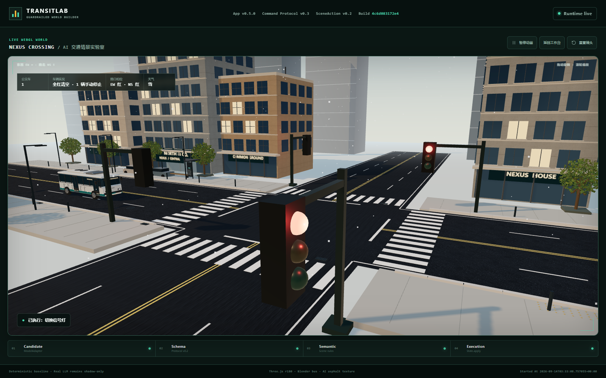
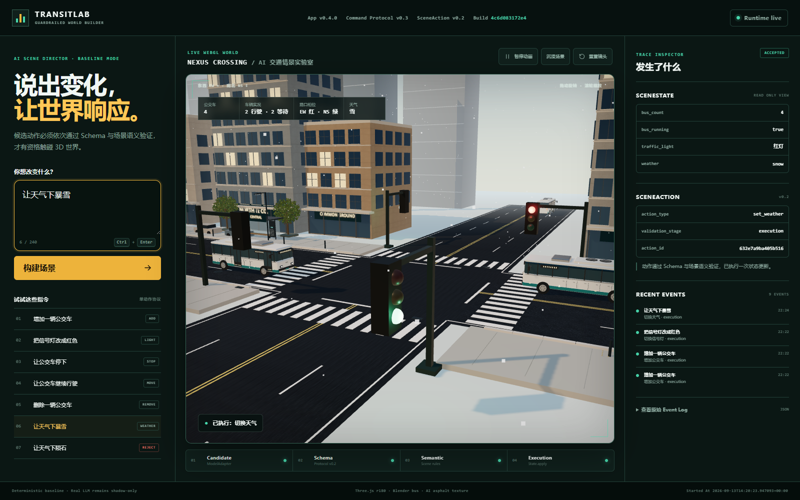

# TransitLab — Guardrailed AI World Builder

TransitLab turns plain-language traffic instructions into validated scene actions and a live browser-native 3D world.

## Source candidate — v0.8.0 (public runtime not verified)

This worktree is developing one fixed, right-hand-drive four-way junction rather than an open-world city. The shared metre-based manifest drives lane markings, protected signal groups, pole/head placement and vehicle routes. The browser uses an automatic EW-through → EW-left → NS-through → NS-left cycle with yellow and all-red clearance; a manual color request is deliberately restricted to all-red or EW-through, and must be previewed and confirmed. `恢复自动信号` returns control to the automatic controller.

The three final original vehicle assets are a GT-inspired sport sedan, a distinct SUV and a low-floor city bus. Each has editable Blender `.blend`, export `.glb` and compact runtime mesh data, four animated wheel pivots and brake lamps bound to motion. The designs use broad real-time-game readability principles only; no licensed game or production-car geometry, logos, or screenshots are included. Blender is authoring-only; the live scene is rendered and animated by Three.js in the browser.

The scene supports clear, rain, snow and fog presentation, plus preview/confirm/undo for the supported deterministic command set. It is still a bounded prototype—not arbitrary natural-language world generation, a certified traffic model, VR, or a promise of award placement. Publishing this source does not prove that Render runs it: automatic deployment is disabled. See [`docs/junction-upgrade-v0.1.md`](docs/junction-upgrade-v0.1.md) for its exact scope and checks.

Latest local verification: **308 Python tests, 42 JavaScript tests**, supported commands 19/19, unsupported/ambiguous rejections 12/12. This candidate adds three observation cameras, daylight/golden/blue-hour presentation, per-layout architectural lighting and roof/sidewalk snow. Balanced quality retains reflective glass without the extra transmission pass; high quality enables transmission. Native frame measurements are not DLSS or generated frames.

Actual browser captures and qualified measurements: [corner/weather evidence](docs/corner-weather-refinement-v0.1.md). The current source fingerprint is `507a7158df77`; compare it with the public `/health` after deployment. Do not use an old public demo or a Blender still as proof of this browser build.

## Local bus-stop scene slice (unreleased)

Run `python -m ai_builder.server` and open the printed HTTP address (do not open index.html directly).
Try `创建公交站情境，然后增加两辆公交车并让天气下雪`. Inspect the projected layout and four actions, then confirm. Preview does not change live state. The new template has a straight two-direction road, two sheltered platforms, docking bays and a pedestrian crossing. Buses pull into a bay, dwell for four simulation seconds, then depart; manual stop also freezes dwell. A red crossing signal stops both directions. `恢复十字路口` restores the original layout while retaining bus count, light, running state and weather.

The local domain retains the SceneAction v0.2 compatibility path and adds v0.3 actions for typed vehicles and signal-controller mode. `set_scene_layout` accepts `parameters: {"layout": "bus_stop"}` or `crossroads`; `set_signal_mode` accepts only `automatic` or `manual`. The earlier real-model ScenePlan shadow schema remains frozen to its six-action evaluation baseline. No live model is used by these commands.

The **Scene Structure Editor** is a bounded UI adapter over that same protocol. Select a layout, target sedan/SUV/bus counts (total at most 24), weather and a safe signal request; it emits the smallest supported command sequence and sends it to the existing preview endpoint. It has no state-writing API of its own. A target requiring more than six expanded actions is rejected by the existing plan limit and never partially applied; larger changes require separately confirmed batches. Configuration inputs are disabled while confirmation is pending to avoid overwriting the next edit with a delayed response.

The local preview-first workbench now also supports a safe undo path. A successful plan is first rendered from its projected detached state; only explicit confirmation commits it. The `撤销上次修改` control creates a server-owned compensating ScenePlan, previews that projected 3D result, and commits it only after a second confirmation. Undo is latest-change-only and stale checkpoints are rejected. See [`docs/scene-preview-undo-v0.1.md`](docs/scene-preview-undo-v0.1.md).

The judge-ready story is documented in [`docs/judge-demo-v0.6.md`](docs/judge-demo-v0.6.md). `tools/run-judge-demo-v06.ps1` starts an isolated local process and drives the real browser UI through creation, preview, confirmation, traffic constraint, safe rejection, undo and recovery, producing checkpoint screenshots without making model API calls.

Layout metadata has one definition in `ai_builder/scene_layouts.json`, shared by Renderer and the visual traffic controller. Domain snapshots omit the default crossroads layout for backward compatibility. Layout changes restart visual vehicle positions, not domain state. This is deterministic template assembly, not arbitrary AI-generated geometry, passenger simulation, VR or a traffic engineering model. Public deployment is unchanged.

Verification: `python -m unittest discover -s ai_builder/tests -q` (308 tests); `node --test tools/test-atmosphere-profile.mjs tools/test-scene-editor.mjs tools/test-bus-stop-controller.mjs tools/test-traffic-controller.mjs` (42 tests). See [`docs/scene-preview-undo-v0.1.md`](docs/scene-preview-undo-v0.1.md) for the earlier preview/undo milestone. The last separately documented public baseline is v0.5; its current reachability/version must be checked, not assumed.

```text
User prompt
→ ModelAdapter candidate
→ SceneAction Protocol v0.2 / v0.3 compatibility
→ Schema validation
→ Semantic validation
→ SceneState.apply
→ Three.js renderer
→ Explainable Event Log
```

The differentiator is not merely prompt-to-3D. The interface makes the safety boundary visible: invalid, ambiguous, or impossible actions are rejected before they can mutate the scene.

## Unreleased competition work

The local `main` working tree now includes the first ScenePlan v0.1 milestone. A compound request such as:

```text
让天气下雪，然后增加两辆公交车并把信号灯改成红色
```

is compiled into an ordered list of SceneAction v0.2/v0.3 candidates. The complete plan is schema-checked and semantically simulated against a detached state before the user sees a preview. Confirmation executes the stored plan once; cancellation, a failed step, or a stale preview leaves the live scene unchanged.

```text
Natural-language request
→ ScenePlan candidate
→ validate each SceneAction against its declared v0.2/v0.3 schema
→ simulate the complete plan on detached state
→ user preview and confirmation
→ atomic commit
→ Three.js world + plan Event Log
```

The current planner is deliberately deterministic. This milestone establishes the execution contract for a future real-LLM planner; it is not yet evidence that arbitrary language is understood, and it has not yet been deployed to the public v0.5 URL.

### Real model ScenePlan shadow evaluation (local, unreleased)

`OpenAIScenePlanAdapter` now proposes ordered semantic actions using Responses API strict structured output. Local code attaches IDs and the original command. The model receives no SceneState object and has no execution method. **LLM has no authority to write state.** The public browser still uses the deterministic planner; this adapter is not a deployed browser capability.

```text
Open language → OpenAIScenePlanAdapter → JSON semantic actions
→ local plan/action IDs → per-action Schema → detached semantic simulation
→ reference sequence/parameter comparison → report (NO live commit)
```

The versioned evaluation set contains 50 authored cases: 30 supported requests and 20 unsupported, ambiguous or adversarial requests. Expected plans are specified independently of the deterministic compiler. Offline replay is an evaluator self-test, not a real-model score:

```powershell
python -m ai_builder.scene_plan_shadow_evaluate --max-cases 50
```

After API credits are available, an explicitly opted-in, three-request smoke run is:

```powershell
$env:AI_BUILDER_ENABLE_REAL_LLM="1"
python -m ai_builder.scene_plan_shadow_evaluate --live --max-cases 3 --case-ids valid-19 valid-03 reject-12 --output-dir artifacts/scene-plan-shadow-next-smoke
```

Configure `OPENAI_API_KEY` as a local environment variable only; never commit it. `AI_BUILDER_LLM_MODEL` optionally overrides the existing `gpt-4o-mini` default. New requests are never automatic: `--live` plus the enable variable are required. No automatic retry is performed; exhausted credits stop the batch. Token counts are recorded when the provider supplies them; monetary cost is not inferred.

The first live smoke attempt on 2026-09-18 returned 429 `credit_balance_exhausted` for all three requests. It produced no candidates, so model-quality metrics are **not measured**, not zero accuracy. Offline reference replay passed 50 cases with zero live-state mutations. See [the measured evidence and limitations](docs/scene-plan-shadow-results-v0.1.md).

Artifacts are saved under `artifacts/scene-plan-shadow-v0.1/` by default: `summary.json`, `cases.jsonl`, `report.md`. Keep each live baseline in a distinct output directory. Saved rows can be rescored without network using `--reclassify-dir <original-directory> --output-dir <different-directory>`; original evidence is preserved.

## Earlier public release candidate

Version `0.5.0` is the competition release candidate:

- real WebGL crossroads district rendered with Three.js;
- Blender-authored electric buses, detailed streets, storefronts, signals and instanced foliage;
- four straight traffic approaches with mutually exclusive EW/NS right-of-way, stop lines and an all-red clearance phase;
- clear, rain, snow and fog scene modes with visible weather and simplified speed policies;
- mouse/touch camera orbit, wheel zoom, reset, and visual pause;
- six scene actions through a versioned protocol;
- visible Candidate → Schema → Semantic → Execution trace;
- read-only scene inspector and raw Event Log;
- deterministic browser path plus a real-LLM shadow evaluation path;
- runtime fingerprint and `/health` identity check;
- Python standard-library server and test suite.


[Watch/download the 2:12 English-captioned demo](https://github.com/Cluckin-VV/AI-builderkack-traffic-lab/releases/download/v0.5.0-rc.1/transitlab-v05-demo-final.mp4) · [Release and verification details](https://github.com/Cluckin-VV/AI-builderkack-traffic-lab/releases/tag/v0.5.0-rc.1)

### Crossroads and city art

The v0.5 candidate adds an original editable Blender bus, AI-generated asphalt and limestone textures, material-batched architecture, leaf-level foliage, real-time planar wet-road reflections and a deterministic crossroads controller. The **沉浸场景** button expands the viewport without changing scene state. This is an interactive WebGL scene, not an image used as the background.



The public Render deployment was verified on 2026-09-14 at App `0.5.0`, commit `038a9ef`, fingerprint `4c6d083172e4`. Public HTTP, WebGL interaction and mobile-layout checks passed; [deployment evidence and cold-start caveats](docs/public-deployment-v0.5.md) are recorded separately. See [asset provenance, reproduction and verification](docs/visual-city-upgrade-v0.1.md). This is a more detailed real-time art direction, not a claim of photorealism or traffic-simulation accuracy.

The browser execution path still uses `FakeModelAdapter`. The real LLM remains shadow-only and cannot call `SceneState.apply`. This is intentional until evaluation evidence supports promotion.

## Run locally

The reproducible runtime is pinned to Python `3.13.5`; the application itself uses only the Python standard library.

```powershell
cd "D:\ai-builder-traffic-lab"
python -m unittest discover -s ai_builder/tests -v
python -m ai_builder.server
```

Open:

- Public demo: [https://ai-builderkack-traffic-lab.onrender.com](https://ai-builderkack-traffic-lab.onrender.com)
- Demo: [http://127.0.0.1:8000](http://127.0.0.1:8000)
- Runtime identity: [http://127.0.0.1:8000/health](http://127.0.0.1:8000/health)
- Render state: [http://127.0.0.1:8000/api/state](http://127.0.0.1:8000/api/state)

The WebGL renderer loads the pinned Three.js module from jsDelivr, so the first browser load requires internet access.

## Public deployment

The repository includes a reproducible Render Blueprint in [`render.yaml`](render.yaml). It defines one free Python web service, runs the complete test suite during the build, starts the standard-library HTTP server, and checks `GET /health`. Automatic deployment is deliberately disabled so a documentation-only commit cannot silently replace the judged demo.

The server keeps loopback defaults locally and automatically binds to `0.0.0.0:$PORT` when Render supplies `PORT`. No database, Redis instance, Docker image, or API key is required for the deterministic public demo.

The deterministic demo is live at [ai-builderkack-traffic-lab.onrender.com](https://ai-builderkack-traffic-lab.onrender.com). Check `/health` for the exact deployed version and fingerprint. The v0.4 deployment evidence and rollback procedure remain in [`docs/public-deployment-v0.4.md`](docs/public-deployment-v0.4.md); current acceptance is in [`docs/public-deployment-v0.5.md`](docs/public-deployment-v0.5.md).

## Supported instructions

Try:

- `增加一辆公交车`
- `删除一辆公交车`
- `把信号灯改成红色`
- `把红灯变回绿色`
- `让公交车停下`
- `让公交车继续行驶`
- `让天气下雨`
- `让天气下暴雪`
- `让天气起雾`
- `恢复晴天`

### 信号与通行语义

- 十字路口的 `红灯` 是全红安全状态：EW 与 NS 两个方向都显示红灯，所有公交在停止线前等待。
- 十字路口的 `绿灯` 目前只授予 EW 方向通行权：EW 绿、NS 红；NS 方向公交在停止线前等待。
- `bus_stop` 布局只有站台进出方向，不是第二条穿越道路；绿灯允许站台方向通行，红灯让车辆在站前停车。
- 3D 信号牌同时显示方向与 `GO` / `STOP` 文本；颜色只是辅助线索，不是唯一状态提示。
- 浏览器控制器只负责把上述已验证的 SceneState 解释成确定性的通行与位置，不会自行改变服务端状态。

The scene capacity is 12 buses. A request for a thirteenth bus is rejected during semantic validation, before `SceneState.apply`, so server state, browser simulation and rendered vehicle count remain consistent. Removing a bus frees one capacity slot.

Compound ScenePlan requests are previewed against a detached state before confirmation. The browser’s projected canvas may therefore show the requested future scene while the read-only live-state inspector still shows the current scene. This distinction is intentional: “预演视图 · 尚未提交” means no live state has changed yet.

Unsupported or combined requests are rejected without changing state, for example:

- `让天气下陨石`
- `增加公交车并把灯变红`
- `下雪并增加一辆公交车`
- `让公交车在红灯前停下`

## Architecture boundary

`scene3d.js` is a renderer. It receives scene data and browser-local simulation snapshots, then renders cameras, vehicles, signals and weather. The separate `traffic-controller.mjs` owns deterministic right-of-way and vehicle positions. Neither module parses commands, creates `SceneAction`, runs protocol validation, or writes server state.



The screenshot above shows four approaches, complementary EW/NS signals, Blender-authored buses and the simplified snow presentation.

The only browser mutation route is:

```text
POST /command
→ injected ModelAdapter
→ JSON
→ schema validator
→ semantic validator
→ SceneState.apply (accepted only)
```

## Hackathon status

This repository is preparing for the AI Builder Hackathon 2026. Kaggle participation was previously recorded as confirmed, the v0.5 browser demo has passed public acceptance, and a 2:12 English-captioned public video is available in the `v0.5.0-rc.1` prerelease. The submission writeup is a final candidate but has not been submitted. Pre-build prototype history, build-period additions, third-party dependencies and AI assistance are explicitly disclosed. Kaggle video-field compatibility, the online form and final Kaggle submission remain outstanding. Public deployment is not proof of completed competition submission.

See [docs/hackathon-prototype-v0.4.md](docs/hackathon-prototype-v0.4.md) for the rules-fit audit and [THIRD_PARTY_NOTICES.md](THIRD_PARTY_NOTICES.md) for dependency provenance.

## Known limits

- deterministic commands do not yet generalize to arbitrary natural language;
- the real LLM path is evaluation-only;
- state and Event Log are process-local and reset when the server restarts;
- traffic uses a browser-local fixed-step crossroads model with four straight routes; it is not calibrated traffic physics and does not yet include turns, pedestrians or route planning;
- weather is a visual/speed-policy demonstration, not a meteorological simulation; “暴雪” currently maps to the single `snow` mode without intensity control;
- the demo depends on a CDN-hosted Three.js module;
- the free Render instance may cold-start after inactivity;
- all visitors to one server instance share process-local demo state.
- the current scene intentionally supports at most 12 buses; the validator rejects additions beyond that capacity.

## License and provenance

The bus is authored by the included Blender script; editable `.blend`, GLB and browser mesh exports are included. City geometry and leaf textures are generated in project code. Asphalt and limestone base-color textures were AI-generated for this project. Three.js and its vendored Reflector addon use the MIT License. See [THIRD_PARTY_NOTICES.md](THIRD_PARTY_NOTICES.md).
