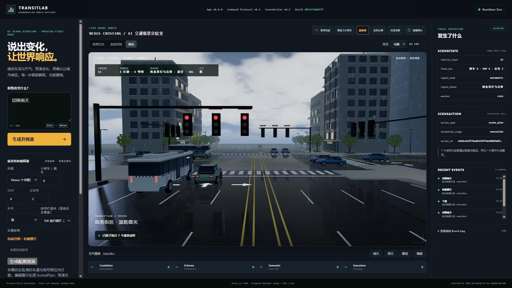
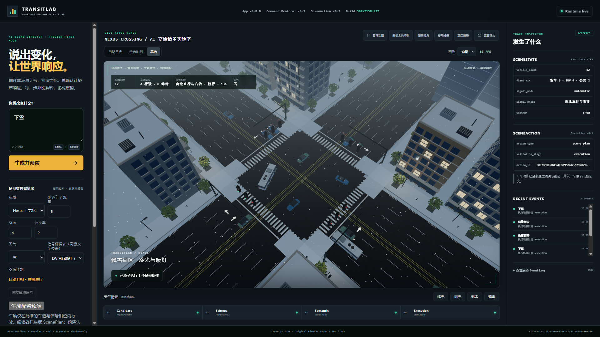
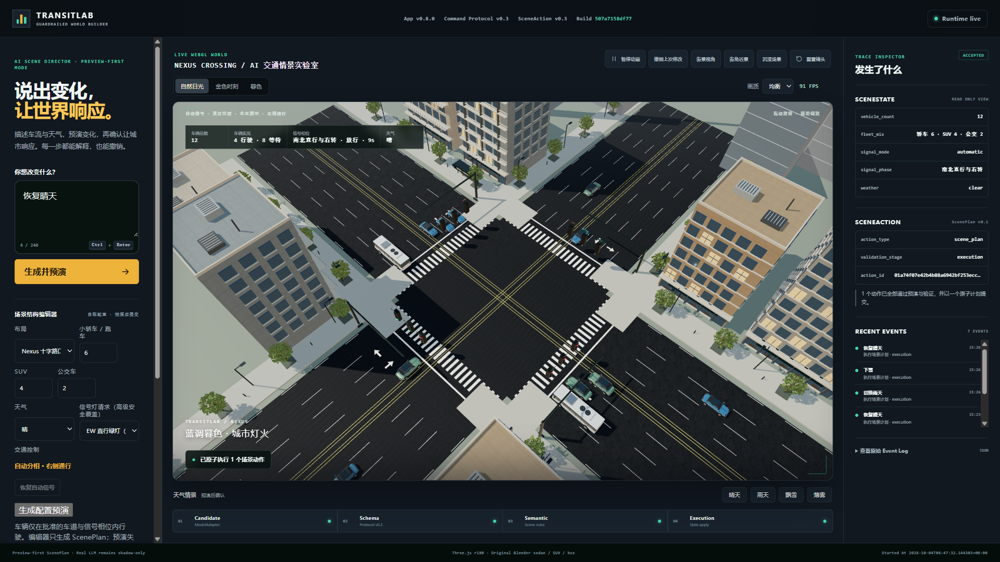

# 街角、镜头与连续运行验收 v0.1

日期：2026-10-04。App 0.8.0 / Command Protocol 0.3 / SceneAction 0.3。

## 参考素材的真实访问状态

用户已提供三条抖音视频链接（modal_id 7689208243867880744、7691513560190438691、7688571158563975161）。已尝试内置浏览器和对应公开视频地址：浏览器连接超时，网页读取工具也无法读取。**没有观看到三段视频**，不据封面编造镜头、光照或作者实现方法。此次画面修改基于本地浏览器观察和原定城市路口方向，而非声称复刻古寺视频。

## 本轮实现

- 增加街角近景，调整道路街景距离，避免巨大信号灯占满前景；相机配置集中在只读表现层配置中。
- 沿街店面增加门把手、展示面、灯带；侧立面增加窗框和窗台，部分楼增加阳台栏杆、竖向框架与遮阳板，屋顶补充设备细节。
- 树冠以更大的叶片簇填充，减少每棵树实例数量；仍为原创程序化原型植被，不是扫描树木。
- 屋顶增加8片动态积雪，与原8片人行道积雪一同过渡；不可进入静态几何批处理。
- 各布局独立持有窗灯材质，日光下压低发光、暮色提高发光；不影响信号灯或车辆逻辑。
- 隐藏或未聚焦窗口不计入前台 FPS；重新聚焦清空采样窗口，不掩盖前台着色器/加载卡顿。操作系统遮挡仍可能使“已聚焦”页面限速，不能保证检测到所有后台情况。
- 发现并修复确认回包覆盖下一批编辑的竞态：确认期间禁用配置输入并设置 aria-busy，完成后恢复。验收逐批等待真实车辆数量，不以填入的目标值作为实际状态。
- 沉浸模式使用完整窗口宽度，不受工作台1920px宽度上限限制。

## 已验证交互

`tools/audit-corner-weather.js` 在真实浏览器通过界面验证：

1. 街角镜头和暮色切换不改变车辆、天气、信号模式。
2. 雨天先预演再确认；雪天预演取消后仍为雨天。
3. 确认雪天后16片积雪面均挂载且可见；恢复晴天全部隐藏。
4. 返回12车、晴天、自动信号，不扩大协议或使用真实付费模型。

截图保留在本地 `output/playwright/corner-*.png`，并选择三张加入版本库；实际浏览器效果是验收依据，不用Blender静帧替代。

### 浏览器画面（12车，1920×1080工作台，非全屏1080p画布）

截图中的FPS是瞬时UI读数，不是这些截图的持续帧率证明；楼房与植被近景仍明显是原型资产。

## 回归

- Python：308 tests OK。
- JavaScript：42 tests OK（新增窗灯边界与命名镜头测试3个）。
- 规则命令评测：合法19/19，非法/歧义12/12；误拒、危险接受、状态误修改、缺失日志均0。
- compileall通过。发布候选文本扫描未命中所检查的凭据模式；这不是正式安全审计保证。

## 外部状态与边界

早先GitHub fetch发生Connection reset，后续两次fetch已恢复，确认main和origin/main仍为旧基线c62afae。本候选需正常提交和push；发布状态另记，不能宣称公网运行的是本地版本。Render自动部署仍关闭，当前浏览器连接报nodeRepl.fetch request failed，无可用Render部署连接；公网health读取曾超时。

本轮未提供DLSS、路径追踪、实时GI、体积光或真实轮胎/悬挂求解。仍不能宣称GTA画质、原生锁60或获奖保证。

## 风险与下一步

最不确定的是参考视频的实际动态效果；最大的遗漏是近景资产和材质仍显原型感；三个月后风险是继续加细节却突破渲染预算。建议下一项差异化功能是同种子晴雪车流对比，必须在隔离模拟里输出有依据的等待指标。协作上优先使用可直接访问的单视频或本地原视频、固定机位与实测记录。

## 连续运行与优化结果

硬件：RTX 5080 Laptop GPU / Core Ultra 9 275HX；Chrome WebGL/ANGLE。不是桌面5080或DLSS4。均衡档，24车（12轿车/8SUV/4公交），雨天、街景、沉浸画布实测1920×1081，DPR约1。

1. **玻璃优化前**：20段30秒RAF采样，总600,237.3ms、26,583帧，合计平均44.29FPS；最差段p95为29.2ms（不是全程p95）；>250ms长帧0。几何/纹理计数249/29到251/31，再延长30秒保持251/31。只可说明该观察窗无持续增长证据，不能证明无泄漏。旧采样只在开头记录画布/车数，后续脚本已增加每帧上下文一致性检查；不把旧结果等同于更严格的新检查。
2. **优化后第一段30秒**：均衡档取消玻璃透射的离屏pass，保留反射。30,008.9ms、1,500帧，平均49.99FPS、p95 25ms、长帧0，资源249/27保持不变。这不是优化后10分钟成绩，也不做跨轮精确提升比例。
3. **优化后再次复测**：画布/车数/天气/镜头保持一致，30,918.3ms、559帧，平均18.08FPS，25个>250ms长帧，末段UI约1FPS。页面仍报告可见且聚焦，原因尚未完全隔离；与浏览器后台/遮挡限速现象一致但不能据此排除其他原因。此异常保留，不能宣称当前版本稳定60FPS。

当前指纹`507a7158df77`。优化后Python308、JS42、规则评测及晴雨雪预演/取消/确认回归重新通过；实际浏览器控制台0错误/0警告，最终恢复12车、晴天、自动信号。尚需稳定前台条件下重跑10分钟，并补低端GPU和实际公网浏览器验证。

### 验收会话隔离

截图重采样曾因等待过渡超时而失败，随后读取发现共享审计标签页已转到8037旧进程；该失败运行不计作新版通过。最终建立独立`candidate-publish`浏览器会话，固定8038、1920×1080窗口，并在每次截图及结束时检查页面URL和运行标识未变；整条交互验收通过，以上三张版本库截图来自这个最终通过运行。旧服务不能用来证明新版执行结果。
